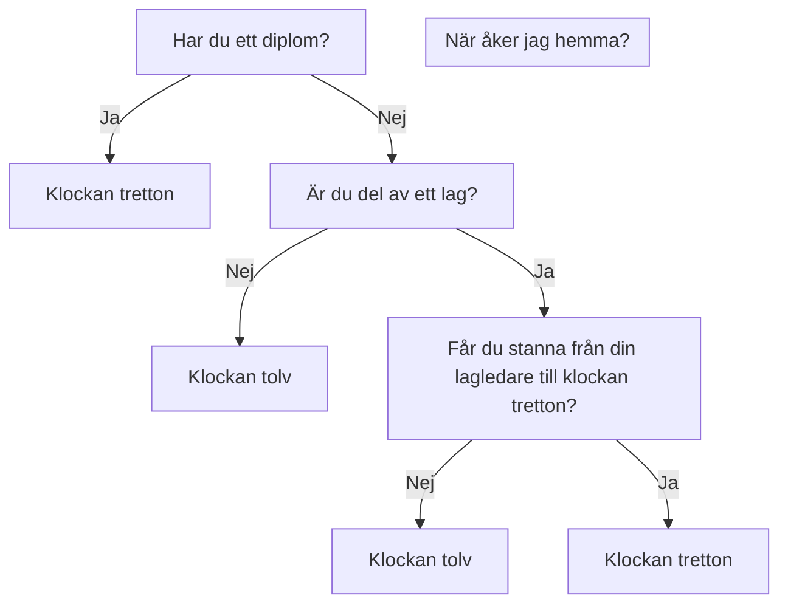

# När åker jag hemma

```mermaid
graph TD;
    subgraph När åker jag hemma?
    end

    10[Har du ett diplom?]-->|Ja|11[Klockan tretton];
    10-->|Nej|20;
    20[Är du del av ett lag?]-->|Nej|21[Klockan tolv];
    20-->|Ja|30;
    30[Får du stanna från din lagledare till klockan tretton?]-->|Nej|31[Klockan tolv];
    30-->|Ja|40[Klockan tretton];
```
